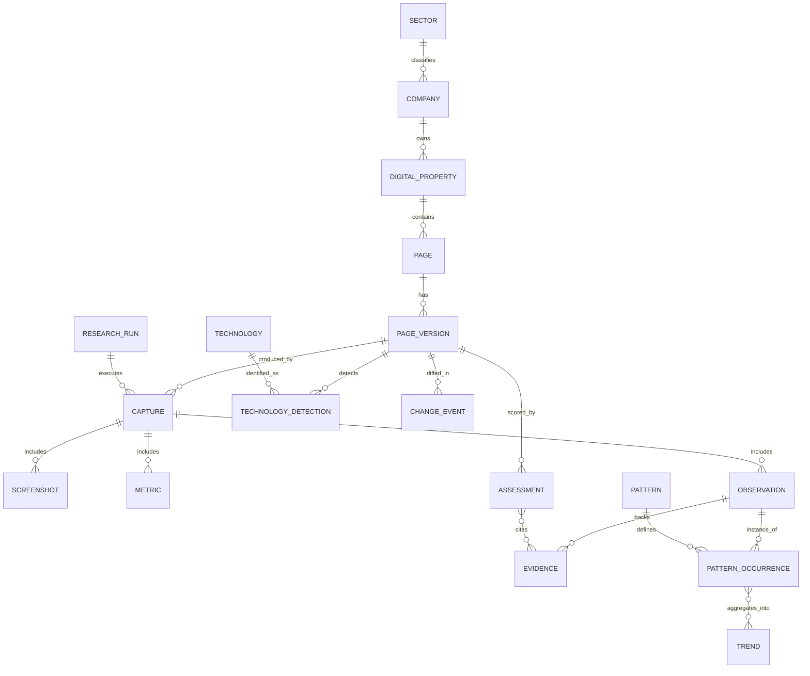

# ARKOS Benchmark Intelligence — Architecture & MVP Specification v0.1

Status: **Draft para aprovação** · Fase: **Phase 0 — Research & Architecture** · Nenhum código foi escrito, nenhuma dependência instalada, nenhum banco criado.

---

## 1. Executive Summary

O ARKOS Benchmark Intelligence é uma plataforma proprietária de inteligência digital que transforma a observação contínua de experiências digitais de referência mundial em conhecimento estruturado, rastreável e reutilizável nos projetos de estratégia, produto, UX/UI, engenharia, marketing e vendas da ARKOS.

Não é um crawler nem um repositório de screenshots. É um sistema de evidência → conhecimento: cada captura bruta é normalizada, avaliada com metodologia explícita e transformada em padrões (patterns) e tendências (trends) rastreáveis até a evidência original.

Este documento define o objetivo de negócio, o modelo de pesquisa, a taxonomia de análise, o modelo de evidência, a arquitetura técnica (com alternativas comparadas), o modelo de dados conceitual, o escopo de MVP, critérios de sucesso, riscos e roadmap. Nenhuma decisão de implementação é executada nesta etapa — o objetivo é aprovar arquitetura antes de escrever código, conforme `references/quality-gates.md`.

**Decisão central recomendada:** iniciar **local-first**, com **~10 empresas em 5 verticais**, pipeline **majoritariamente manual/assistido por IA com revisão humana**, banco **SQLite** e armazenamento em **filesystem local**, validando o pipeline completo (Capture → Evidence → Pattern → Insight) antes de qualquer automação de larga escala.

---

## 2. Business Objective

### Problema que o sistema resolve
Hoje, recomendações estratégicas, de UX/UI e de produto da ARKOS se apoiam em benchmarking informal — memória, opinião individual ou pesquisa pontual não estruturada. Isso é difícil de defender comercialmente, não é reutilizável entre projetos e não gera ativo de propriedade intelectual acumulável.

### Usuários internos
- Estrategistas/consultores ARKOS (discovery e propostas)
- UX/UI designers (referências de padrão validadas)
- Engenheiros/arquitetos (referências técnicas observáveis)
- Marketing e vendas (argumentos comerciais evidenciados)
- Liderança (posicionamento e diferenciação de portfólio)

### Jobs To Be Done
- "Quando estou desenhando a estratégia digital de um cliente, quero padrões comprovados de líderes do setor para embasar minhas recomendações com evidência, não opinião."
- "Quando estou propondo um redesign, quero mostrar ao cliente exemplos concretos e analisados, não só gosto pessoal."
- "Quando estou avaliando se uma tendência (ex.: IA conversacional em sites B2B) é real ou modismo, quero dados de recorrência, não uma amostra de 2 sites."

### Decisões que o sistema deve apoiar
Priorização de padrões de IA/UX/conversão em propostas; validação de hipóteses de design antes de investir em produção; benchmarking competitivo específico por cliente; conteúdo de autoridade (relatórios, thought leadership) fundamentado em evidência.

### Valor estratégico para a ARKOS
Diferenciação comercial (venda baseada em evidência, não em portfólio subjetivo); aceleração de discovery (referências prontas em vez de pesquisa ad-hoc por projeto); ativo de propriedade intelectual acumulável e defensável ao longo do tempo.

### Propriedade intelectual e vantagem competitiva
O valor não está nos screenshots (facilmente replicáveis), e sim na **metodologia de classificação, nos rubrics de scoring calibrados e na base de padrões curada com rastreabilidade**. É esse conhecimento estruturado — não a coleta bruta — que constitui o ativo defensável.

### Productization futura (condicional)
Relatórios de benchmark por vertical como serviço vendável; API/dashboard de "Digital Experience Intelligence" para clientes enterprise; assinatura de tendências setoriais. **Tratado como hipótese de Phase 6**, não como objetivo do MVP — ver seção 21.

### Crítica ao conceito inicial
A ambição de "50+ empresas por vertical" e "verdadeira Digital Experience Intelligence Platform" é válida como visão de longo prazo, mas apresenta risco real de se tornar um projeto de dados caro e subutilizado se não for validado em pequena escala primeiro. Este documento trata a visão como **norte, não como MVP** — o MVP (seção 18) é deliberadamente pequeno e existe para provar (ou refutar) a tese antes de qualquer escala.

---

## 3. Research Model

### Verticais iniciais
Education/EdTech · Business/B2B · Sales/CRM/Revenue · Services · Digital Leaders cross-industry — arquitetura suporta novos setores via `Sector` como entidade extensível, não hardcoded.

### Critério de seleção de empresas (por categoria, não por tamanho)
Uma empresa grande **não** é automaticamente boa prática. Cada empresa candidata deve se qualificar em ao menos uma categoria explícita, com evidência pública citável:

| Categoria | Critério objetivo (evidência exigida) |
|---|---|
| Market Leader | posição de mercado documentável (receita/marketshare/ranking de analistas — fonte citada) |
| Digital Leader | reconhecimento público de qualidade digital (prêmios de design/UX, cobertura editorial especializada) |
| Design Reference | citada recorrentemente em benchmarks/publicações de design como referência visual/IA |
| Technology Reference | stack/arquitetura observável tecnicamente sofisticada ou influente (ex.: pioneira em padrão técnico adotado depois por outros) |
| Conversion Reference | case público de otimização de conversão (case study, relatório de CRO, palestra documentada) |
| Innovation Reference | uso público e verificável de IA/personalização/interface generativa na experiência digital |

Cada empresa registrada carrega 1+ tags de categoria com a fonte da evidência — isso é o que substitui "empresa grande = boa prática" por um critério auditável.

### Escala
Visão de longo prazo: 50+ empresas por vertical. MVP: **~10 empresas**, cobrindo os 5 verticais iniciais (2 em média por vertical), priorizando diversidade de categoria sobre cobertura completa — ver seção 18.

---

## 4. Benchmark Taxonomy

Taxonomia expandida a partir da proposta original, com dimensões adicionadas para evitar lacunas relevantes.

**Strategy** — positioning, value proposition, audience, differentiation, messaging, storytelling, business model presentation.

**Information Architecture** — sitemap, navigation, hierarchy, findability, search, taxonomy, mega-menu patterns.

**UX** — journeys, usability, interaction, cognitive load, onboarding, self-service, error/empty states.

**UI** — layout, grid, spacing, typography, colors, imagery, illustration, iconography, components, visual hierarchy.

**Motion** — animations, transitions, microinteractions, scroll behavior.

**Conversion** — CTA, forms, lead generation, pricing presentation, trials, demos, social proof, cases, trust signals.

**Content** — copy, tone, information density, educational content, product communication.

**Technology** — frontend signals, CMS, frameworks, CDN, analytics, third-party services, observable infrastructure.

**Performance** — Core Web Vitals, loading, assets, responsiveness.

**SEO** — metadata, structured data, technical SEO, content architecture.

**Accessibility** — indicadores relacionados a WCAG, semântica, contraste, teclado, ARIA, formulários.

**AI** — assistants, search, recommendation, personalization, generative interfaces.

**Trust & Security** *(somente sinais observáveis externamente)* — avisos de privacidade/cookies, badges de conformidade visíveis (ex.: menção a SOC2/GDPR na própria página), sinais de confiança de pagamento, páginas de status público, políticas publicadas.

**Dimensões adicionadas (lacunas na proposta original):**
- **Localization/Internationalization** — idiomas, adaptação regional, moeda/formato.
- **Pricing & Commercial Model** — transparência de preço, modelo (self-serve vs. sales-led), presença de calculadora/ROI tool.
- **Ecosystem/Developer Experience** — documentação técnica, portal de parceiros/API, comunidade pública.
- **Mobile & Cross-Platform Continuity** — paridade entre site, app e outros pontos de contato quando publicamente observável.

---

## 5. Evidence Model

Cinco tipos, com definição estrita e obrigatoriedade de rastreabilidade:

| Tipo | Definição | Exemplo |
|---|---|---|
| **OBSERVADO** | fato bruto capturado diretamente, sem interpretação | texto de um H1, pixel de um screenshot, header HTTP |
| **MEDIDO** | métrica quantificada por ferramenta com metodologia registrada e reproduzível | Core Web Vital, contraste calculado, tempo de carregamento |
| **DOCUMENTADO** | fonte externa autoritativa citada, não inferida | post oficial da empresa, press release, case study publicado |
| **INFERIDO** | conclusão analítica derivada por IA/ARKOS a partir de evidência acima, com score de confiança e cadeia de raciocínio registrada | "este hero segue o padrão split-image-left, comum em SaaS enterprise" |
| **RECOMENDADO** | julgamento aplicado da ARKOS para uso em projeto de cliente — não é um fato sobre a empresa observada | "recomendamos este padrão de CTA para o cliente X" |

**Regra de rastreabilidade:** todo `Assessment` (score) e todo `Pattern`/`Insight` deve referenciar o(s) `Evidence`/`Observation` id(s) que o sustentam. Isso é o que permite, no futuro, responder "por que o sistema classificou isso como boa prática?" — percorrendo Insight → Evidence[] → Capture original. Sem esse vínculo, um registro não pode ser promovido a INFERIDO ou RECOMENDADO — permanece rascunho.

---

## 6. Data Acquisition Model

### Screenshots
- **Viewports:** desktop (1440×900) e mobile (390×844, referência iPhone-class).
- **Modo:** full-page + above-the-fold isolado (hero) sempre; componentes-chave (nav, footer, bloco de pricing, CTA principal) como recortes direcionados quando tecnicamente viável.
- **Modais/menus/estados interativos:** apenas quando acionáveis sem autenticação e sem contornar proteção alguma (ver seção 20).
- **Deduplicação:** hash perceptual (pHash) — se a distância entre captura atual e anterior for abaixo de um limiar, não versionar novo binário, apenas registrar "sem mudança visual".
- **Compressão:** WebP/AVIF para armazenamento; PNG apenas se necessário para análise pixel-exata.
- **Nomenclatura:** `{company-slug}/{property-slug}/{page-slug}/{yyyy-mm-dd}_{viewport}_{hash8}.webp`.
- **Retenção:** política explícita, não "guardar para sempre". Proposta: manter todas as capturas do Daily Scan por 90 dias (para diagnosticar mudanças recentes), depois reduzir para 1 captura/mês; manter todas as capturas de Weekly Deep Benchmark por 12 meses, depois reduzir para 1/trimestre. Revisar quando houver volume real.

### Captura de conteúdo — classificação por relevância

| Classe | Itens |
|---|---|
| **ESSENTIAL** | URL, timestamp, status HTTP, title, meta description, H1–H2, labels da navegação principal, texto+destino do CTA primário, presença/tipo de structured data (JSON-LD), screenshot conforme cadência |
| **USEFUL** | outline completo de headings, todos os CTAs, contagem/tipo de campos de formulário (nunca valores), links de footer, preços quando públicos, menções de social proof, métricas de performance, sinais automatizados de acessibilidade, scripts de analytics/tag manager detectados publicamente, paleta extraída do screenshot, família tipográfica via CSS |
| **OPTIONAL** | arquivo completo de DOM/HTML, todos os links de saída, auditoria de alt-text, inventário de animações, metadados de assets, parse de sitemap.xml/robots.txt |
| **AVOID** | qualquer conteúdo atrás de autenticação/paywall, dado pessoal de qualquer indivíduo, cookies/sessão de usuário real, qualquer bypass de proteção anti-bot, reprodução integral de texto além do necessário para citar um padrão (extrair padrão, não copiar copy inteira), preço não publicado explicitamente como lista pública |

---

## 7. Change Detection

Fingerprint leve por página (hash de estrutura HTML normalizada + nós de texto-chave + meta) comparado dia a dia. Complementado por monitoramento reforçado de seletores de alto sinal (hero, navegação, pricing).

**Classificação:**
- **Trivial:** espaçamento, ano de copyright, banner de cookies, hash de CSS sem mudança visual perceptível.
- **Estrategicamente relevante:** mudança de headline/value proposition do hero, reestruturação de navegação, mudança de pricing, página nova/removida, redesign visual detectado por distância de hash perceptual no hero, mudança no fingerprint de tecnologia.

Mudança classificada como relevante dispara Weekly Deep Benchmark fora do ciclo normal para aquela empresa/página específica, em vez de esperar o próximo ciclo semanal.

---

## 8. Cadence

Duas camadas, com uma correção proposta em relação à ideia original de aplicar a mesma frequência a todo o universo:

- **Daily Scan:** fingerprint leve, sem screenshot, baixo custo — destinado a change detection.
- **Weekly Deep Benchmark:** análise aprofundada (screenshots, observações estruturadas, scoring) apenas para sites alterados ou priorizados.

**Melhoria recomendada — cadência em camadas (tiers):**
- *Tier 1 (watchlist core — as ~10 empresas do MVP):* Daily Scan + Weekly Deep.
- *Tier 2 (conjunto de expansão, quando a base crescer para 50+/vertical):* Weekly Scan + Monthly Deep.

Justificativa: escanear diariamente 50+ empresas por vertical desde o início é custo desnecessário sem retorno proporcional; a cadência deve escalar com a maturidade da base, não ser uniforme.

---

## 9. Intelligence Pipeline

Pipeline conceitual, com duas adições críticas em relação à proposta original:

```
Capture → Extract → Normalize → Analyze → Classify → Score → Compare
        → Detect Patterns → Detect Trends → Generate Insights
        → [Validate / Human Review] → Store Knowledge → (feedback loop)
```

**Adição 1 — Validate/Human Review antes de Store Knowledge:** classificação subjetiva de qualidade de UX é um risco real de alucinação silenciosa. No MVP, todo `Assessment` e `Pattern` gerado por IA passa por revisão humana (estrategista ARKOS) antes de ser promovido a conhecimento reutilizável. Esse gate é reduzido progressivamente conforme o rubric de scoring se prova consistente (ver seção 11).

**Adição 2 — Feedback loop:** conhecimento armazenado é usado em trabalho real de cliente; o resultado desse uso (o padrão realmente ajudou a convencer/decidir?) retroalimenta a calibração do modelo de scoring. Sem esse loop, o sistema vira um arquivo estático em vez de um sistema de aprendizado.

---

## 10. Scoring Model

Multidimensional, por dimensão da taxonomia (seção 4) — nunca uma nota única de "melhor site".

**Redução de subjetividade:**
1. **Rubric explícito por dimensão** (nos moldes de `references/quality-gates.md`): cada nível 1–5 tem critério descrito, não é julgamento livre.
2. **Nenhum score sem evidência anexada** — score sem `Evidence` vinculado é inválido por definição (seção 5).
3. **Duas passadas:** IA propõe score + racional; humano ARKOS valida/ajusta no MVP (human-in-the-loop).
4. **Checagem periódica de consistência:** repetir scoring em uma amostra para medir estabilidade (re-run/inter-rater) antes de confiar no rubric em escala.

**Composite score:** não existe como métrica padrão. Um composto (ex.: "conversion-readiness score") só é calculado sob demanda para um caso de uso específico (ex.: proposta comercial), com pesos visíveis e explicáveis — nunca como headline padrão do sistema.

---

## 11. Pattern Intelligence

Requer vocabulário controlado de tags nas `Observations` (ex.: `hero_layout: split-image-left`, `social_proof_type: logo-wall`) em vez de texto livre — sem isso, não é possível agregar/consultar padrões de forma confiável.

`PatternOccurrence` liga uma definição de `Pattern` a instâncias específicas de `Evidence`/`PageVersion` ao longo do tempo e entre empresas, permitindo contagem de frequência, direção de tendência (crescendo/declinando por janela temporal) e comparação entre verticais. É essa estrutura — não texto livre analisado ad-hoc — que viabiliza perguntas como "quais estruturas de Hero predominam entre líderes SaaS?" no futuro.

---

## 12. Knowledge Architecture

Camadas distintas, com escopo explícito por fase:

| Camada | Conteúdo | Fase |
|---|---|---|
| **Raw data** | screenshots, DOM, HTML bruto | MVP |
| **Structured data** | campos normalizados, tags, métricas em schema relacional | MVP |
| **Analytical data** | scores, PatternOccurrence, Trend — derivados/computados | MVP (básico) → Phase 3 (maturo) |
| **Knowledge** | insights curados com narrativa + evidência vinculada, versionados, revisados | Phase 3 |
| **Embeddings** | representação vetorial de texto/insights para busca semântica/RAG — construída sobre Knowledge, não é fonte de verdade | Phase 4 |

O MVP não precisa de busca semântica/RAG — com ~10 empresas, busca por palavra-chave (full-text) é suficiente. Vetorização é prematura antes de haver corpus de conhecimento curado.

---

## 13. Technical Architecture

Comparações antes de recomendação (vendor-agnostic, conforme `CLAUDE.md` seção 7).

### Browser automation
| Opção | Prós | Contras |
|---|---|---|
| **Playwright** *(recomendado)* | multi-browser, API moderna, captura de screenshot/rede nativa, manutenção ativa, bindings Python/TS | — |
| Puppeteer | leve, maduro | essencialmente Chrome-only |
| Selenium | muito maduro, amplo suporte legado | mais pesado, API mais antiga, sem vantagem clara aqui |

### Backend
| Opção | Prós | Contras |
|---|---|---|
| Python (FastAPI) | ecossistema forte para dados/IA (pandas, ML), natural para a Intelligence Layer | — |
| Node/TypeScript (NestJS/Express) | mesma linguagem do Playwright em TS, unifica stack se ARKOS já usa TS no frontend | ecossistema de dados/ML mais fraco |

**Decisão em aberto** (seção 22): depende da stack e capacidade real da equipe ARKOS, que não deve ser assumida. Recomendação condicional: Python se o pipeline de IA/dados for o núcleo do valor (é o caso aqui); Node se houver forte preferência de unificação de linguagem com produtos web da ARKOS.

### Banco de dados
| Opção | Prós | Contras |
|---|---|---|
| **SQLite** *(recomendado para MVP)* | zero-ops, arquivo único, backup trivial, adequado a local-first em `C:\ARKOS` | sem concorrência real, sem full-text/vector nativo avançado |
| **PostgreSQL** *(recomendado para escala)* | concorrência, JSON/JSONB, full-text (tsvector), extensão `pgvector` para embeddings futuros — caminho natural de migração | requer operação de servidor |

### Files / screenshots
Local filesystem (MVP, sem custo, controle total) → object storage compatível com S3 (AWS S3, Cloudflare R2, MinIO self-hosted) quando volume/colaboração exigirem (Phase 2+). Recomenda-se desenho híbrido desde o início (caminho de arquivo abstraído, não hardcoded), para não exigir reescrita.

### Search
Full-text (SQLite FTS5 ou Postgres `tsvector`) suficiente para o MVP. Vector search (pgvector, Qdrant, Chroma) adiado para Phase 3+, quando houver corpus de Knowledge curado que justifique RAG — prematuro com 10 empresas.

### AI providers
Camada de abstração fina (interface única para "classify/extract/summarize") para permitir Claude, OpenAI, Gemini ou modelos locais (Ollama) de forma intercambiável — nunca hardcode de fornecedor. Claude é o default operacional natural do MVP dado que o próprio workspace já opera em Claude Code e a Skill `arkos-digital-intelligence` já existe nesse ecossistema — isso é uma conveniência operacional atual, não um lock-in permanente.

---

## 14. Local-First vs Cloud

| | Local-first | Cloud-first | Hybrid |
|---|---|---|---|
| Custo | zero | recorrente desde o dia 1 | baixo no início, cresce com uso |
| Simplicidade | alta | média (setup de infra) | média |
| Segurança/privacidade | controle total | depende do provedor | controle do capture, provedor para storage |
| Backup | manual/disciplinado | nativo do provedor | ambos |
| Automação | via Task Scheduler local | via CI/CD/cloud scheduler | local dispara, cloud armazena |
| Colaboração/acesso remoto | nenhum | nativo | parcial |
| Escalabilidade | limitada | alta | alta, com custo controlado |

**Recomendação:** **local-first para o MVP** (`C:\ARKOS`, SQLite, filesystem) — sem custo, controle total, validação rápida da tese. **Hybrid para Phase 2+** (captura local ou agendada + storage/DB em nuvem) quando houver necessidade real de colaboração/escala comprovada pelo MVP. Cloud-first pleno é prematuro antes de validar o pipeline.

Mesmo local-first exige política de backup explícita: dados estruturados/config/knowledge versionados em Git (texto, baixo volume); screenshots/binários grandes **não** devem entrar no Git (conforme `.gitignore` já criado) — precisam de rotina de backup/export periódico separada (ex.: cópia para storage externo), a ser definida na Phase 1.

---

## 15. Data Model

Refinamento do modelo proposto pelo usuário. Crítica ao original: "Domain" e "Digital Property" se sobrepõem — uma Digital Property (site de marketing, app, docs, blog) já é definida por seu domínio/subdomínio; tratá-los como duas entidades separadas cria ambiguidade sem ganho. `Pattern`/`Trend` não devem ser filhos diretos de `Evidence` na cadeia linear — são entidades analíticas agregadas, conectadas via `PatternOccurrence`. Faltavam `Sector`, `Assessment`, `Technology` e `ResearchRun` (proveniência/auditoria de execução), agora incluídos.



**Notas de entidade:**
- `Assessment` = score por dimensão da taxonomia por `PageVersion`, com `evidence_ids[]` obrigatório e `reviewer` (humano ou IA+revisor).
- `ChangeEvent` = diff entre duas `PageVersion`, com `magnitude` e `classification` (trivial/relevante), conforme seção 7.
- `ResearchRun` = metadado de execução em lote (tipo daily/weekly, empresas cobertas, status, erros) — proveniência/auditoria, não dado de negócio.
- `Evidence` não é uma tabela isolada e sim o papel que `Observation`/`Metric`/`Screenshot`/`Documentado-externo` cumprem quando referenciados por um `Assessment` ou `Pattern` — evita duplicar dado.

---

## 16. File Architecture *(proposta — não criar ainda)*

```
C:\ARKOS\intelligence\
├── registry\              # cadastro canônico de empresas/setores — YAML, versionado em git
│   └── companies\<sector>\<company-slug>.yaml
├── captures\               # artefatos brutos de captura — NÃO versionado em git (binário/volume)
│   └── <company-slug>\<property-slug>\<yyyy-mm-dd>\
│       ├── screenshots\
│       ├── dom\
│       └── metrics.json
├── patterns\               # base de padrões curada — markdown/YAML, versionado em git
│   └── <pattern-slug>.md
├── reports\                # relatórios de síntese semanal — versionado em git
│   └── <yyyy>\<yyyy-mm-dd>-weekly-synthesis.md
├── database\               # arquivo(s) SQLite do MVP — NÃO versionado em git, backup separado
└── config\                 # configuração de scan, taxonomia, rubrics de scoring — versionado em git
```

Isso implica revisar a política atual de `.gitignore` (`*.sqlite`, `*.db` já ignorados — correto; será necessário adicionar `intelligence/captures/` ao `.gitignore` quando o diretório existir, mantendo `intelligence/registry/`, `intelligence/patterns/`, `intelligence/reports/` e `intelligence/config/` versionados como conhecimento/IP da ARKOS).

---

## 17. MVP Scope

**Pergunta que o MVP precisa responder:** conseguimos transformar automaticamente um conjunto pequeno de sites em inteligência digital estruturada e reutilizável?

- **Empresas:** ~10, cobrindo os 5 verticais iniciais, selecionadas pelos critérios da seção 3 (não por tamanho).
- **Páginas por empresa:** 3–5 — home, pricing/produto, uma página de conversão (signup/demo), uma página de conteúdo/case study, opcionalmente about/positioning. Escolhidas por concentrarem a maior parte das dimensões da taxonomia com menor esforço de captura.
- **Capturas:** 1 deep capture baseline por empresa (desktop + mobile, observação completa) + Daily Scan de fingerprint durante uma janela de validação de 4–6 semanas + ao menos 1 deep capture de follow-up para testar change detection e versionamento de ponta a ponta.
- **Métricas:** performance (Web Vitals via ferramenta pública), sinais automatizados de acessibilidade, presença de metadados SEO, fingerprint de tecnologia.
- **Análises:** scoring assistido por IA com revisão humana em todas as dimensões da taxonomia (seção 10); extração de ao menos 3–5 padrões demonstráveis (ex.: padrão de hero, padrão de CTA, padrão de apresentação de pricing) para provar a Pattern Intelligence de ponta a ponta.
- **Output:** 1 relatório de síntese demonstrando a cadeia completa (Capture → Evidence → Pattern → Insight → Recommendation), utilizável em um pitch real ou material de referência interna da ARKOS.

---

## 18. Success Criteria

| Veredito | Critério |
|---|---|
| **GO** (escalar para 50+/vertical) | change detection identificou mudanças reais com baixa taxa de falso positivo/negativo na janela de teste; scoring produziu resultados consistentes em re-execução; ao menos parte relevante dos padrões extraídos foi validada como genuinamente útil por estrategistas ARKOS em uso real; custo por empresa/semana dentro de orçamento aceitável; operação sustentável sem dedicação full-time de um engenheiro |
| **ITERATE** | pipeline funciona tecnicamente, mas qualidade/utilidade da evidência é incerta, ou custo/esforço desproporcional ao valor — refinar taxonomia/scoring/automação antes de escalar |
| **STOP** | inviabilidade técnica fundamental (bloqueio anti-bot generalizado, risco jurídico/ToS não administrável), ou evidência de que o conhecimento gerado não é acionável para o trabalho real da ARKOS |

---

## 19. Risks & Mitigations

| Risco | Mitigação |
|---|---|
| Técnico (anti-bot, bloqueio) | respeitar e pular graciosamente; nunca contornar |
| Jurídico/ToS/robots.txt/copyright | design compliance-first (seção 20); revisão antes de escalar volume |
| Privacidade | zero coleta de PII; apenas dado público |
| Custo de IA | tetos de orçamento, cache/batch, modelos mais baratos para extração, modelo premium só para síntese |
| Crescimento de armazenamento | política de retenção (seção 6), deduplicação, compressão, storage em camadas |
| Fragilidade de scraping | seletores resilientes, degradação graciosa, alerta em falha de captura (nunca lacuna silenciosa) |
| Alucinação | vínculo obrigatório a evidência (seção 5), gate de revisão humana no MVP, score de confiança |
| Classificação subjetiva | rubrics explícitos, múltiplas passadas, amostra de calibração |
| Redesign/data drift | tratado pelo próprio Change Detection (seção 7) |
| Vendor lock-in | camadas de abstração para IA/storage/DB (seção 13) |
| Manutenção | escala controlada por gates de fase (seção 21), cadência em camadas (seção 8) |

---

## 20. Compliance & Coleta Responsável

Alinhado a `references/benchmark-protocol.md` e `CLAUDE.md` seção 11: respeitar robots.txt, termos de uso, limites de requisição, propriedade intelectual, privacidade, autenticação e legislação aplicável. Nunca contornar CAPTCHA, autenticação, paywall ou controle de acesso. Preferir metadados, observações estruturadas e padrões extraídos a cópia integral de conteúdo protegido.

---

## 21. Roadmap

| Fase | Escopo | Gate de saída |
|---|---|---|
| **Phase 0 — Research & Architecture** | este documento | aprovação do usuário |
| **Phase 1 — MVP** | 10 empresas, pipeline assistido, local-first, SQLite+filesystem, scoring com rubric, change detection básico, 1 relatório de síntese | critérios GO/ITERATE/STOP (seção 18) |
| **Phase 2 — Automation** | execução agendada (Task Scheduler/CI), cadência em camadas, expansão inicial rumo a 50/vertical em 1–2 verticais, storage híbrido | automação estável, custo previsível, uso ativo pelo time ARKOS |
| **Phase 3 — Intelligence** | calibração madura de scoring, pattern/trend intelligence em escala, curadoria de knowledge base, redução progressiva de human-in-the-loop | uso mensurável em entregáveis/propostas de cliente |
| **Phase 4 — Knowledge Platform** | busca semântica/RAG sobre a knowledge base, interface de consulta interna, relatórios avançados | adoção interna comprovada |
| **Phase 5 — Scale** | todos os verticais-alvo em 50+ empresas, infraestrutura cloud, observabilidade completa | unit economics sustentável |
| **Phase 6 — Potential Productization** | produto/serviço externo de benchmark (relatório vendável, dashboard, assinatura) | business case explícito, revisão jurídica/comercial separada — **não assumido, decisão de negócio própria** |

---

## 22. Architecture Decisions

| ID | Decisão |
|---|---|
| AD-01 | Modelo de evidência com 5 tipos (Observado/Medido/Documentado/Inferido/Recomendado) e rastreabilidade obrigatória |
| AD-02 | Playwright como automação de browser recomendada |
| AD-03 | SQLite para o banco do MVP; caminho de migração para PostgreSQL definido para escala |
| AD-04 | Filesystem local para armazenamento de captura no MVP; object storage adiado para Phase 2+ |
| AD-05 | Camada de abstração vendor-agnostic para provedores de IA (Claude como default operacional do MVP, não lock-in) |
| AD-06 | Cadência em camadas (Tier 1/Tier 2) em vez de frequência uniforme para todo o universo |
| AD-07 | Human-in-the-loop obrigatório para scoring/patterns no MVP, reduzido progressivamente por fase |
| AD-08 | Registry, patterns, reports e config versionados em Git; captures e database excluídos via `.gitignore` |
| AD-09 | Entidade `Digital Property` absorve o conceito de `Domain` (evita sobreposição); `Pattern`/`Trend` conectados via `PatternOccurrence`, não como filhos lineares de `Evidence` |

---

## 23. Open Questions

- Preferência real de stack da equipe ARKOS (Python vs. Node/TS) — impacta decisão de backend (seção 13).
- Orçamento disponível para uso de IA no pipeline (define agressividade de automação na Phase 2).
- Capacidade de revisão jurídica disponível para validar expansão de coleta antes da Phase 2/5.
- Phase 6 (productization) é de fato um objetivo de negócio da ARKOS, ou apenas uma hipótese a manter em observação?
- Papéis internos concretos que usarão o sistema no dia a dia (para desenhar a interface de consulta da Phase 4).
- Preferência de provedor cloud quando a Phase 2 (hybrid) for iniciada.
- Governança de fronteira entre dados de projeto de cliente e conhecimento de benchmark — nunca devem se misturar; regra explícita a formalizar antes da Phase 1.

---

## 24. Recommended Next Step

Não implementar ainda. Próximo passo recomendado: revisão e aprovação deste documento pelo usuário, com resolução prioritária das Open Questions de maior impacto arquitetural (stack de backend e lista definitiva das ~10 empresas do MVP). Só então avançar para um plano de execução detalhado da Phase 1 (ainda sem código) — backlog de tarefas do MVP, não scaffolding de sistema.
