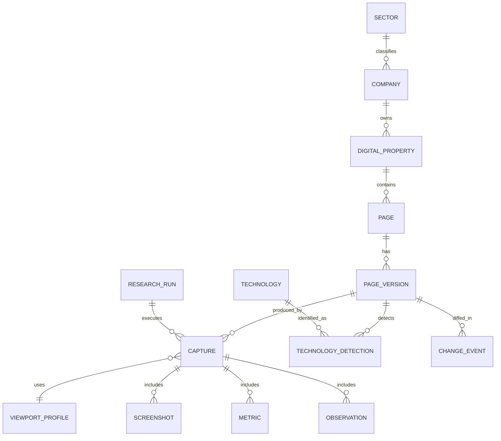
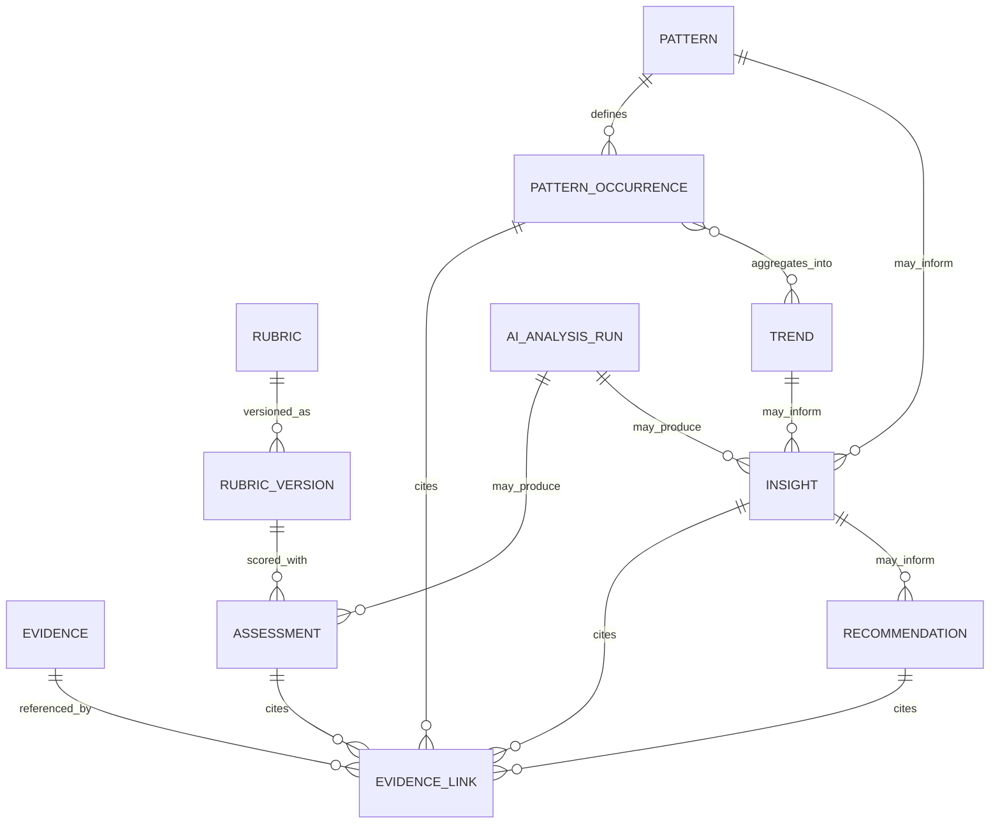

# ARKOS Benchmark Intelligence — Architecture & MVP Specification v0.2

```
Version: 0.2
Status: Architecture Gate 01 incorporated — APPROVED WITH CHANGES
Previous version: benchmark-intelligence-architecture-v0.1.md
```

Este documento é autocontido: substitui a v0.1 como referência de trabalho corrente. A v0.1 permanece preservada, intacta, como histórico do Architecture Gate 00. Nenhum código foi escrito, nenhuma dependência instalada, nenhum banco criado nesta revisão.

---

## Changes from v0.1

1. **Evidence** deixa de ser um "papel" informal e passa a ser entidade de primeira classe, auditável, com `EvidenceLink` associativo conectando-a a Assessment, PatternOccurrence, Insight e Recommendation.
2. **Insight** formalizado como entidade explícita, distinta de Pattern, Trend e Recommendation, com cadeia conceitual `Evidence → Pattern/Trend → Insight → Recommendation` (não obrigatoriamente linear).
3. **Pattern ≠ Best Practice** — formalizada separação entre prevalência/recorrência e avaliação de qualidade; distinção explícita entre *Observed Pattern* e *ARKOS Best Practice Recommendation*.
4. **Rubrics versionados** (`Rubric` / `RubricVersion`) — todo `Assessment` referencia a versão exata usada.
5. **Proveniência de IA** formalizada via `AIAnalysisRun` — modelo, prompt, taxonomia, rubric, custo e revisão humana rastreáveis.
6. **Viewport Profiles** substituem dimensões fixas hardcoded (`1440x900`, `390x844`) por perfis versionados e reproduzíveis.
7. **Daily Scan em cascata** — pipeline progressivo (HTTP Probe → fingerprints → classificador de significância) que evita automação de browser desnecessária.
8. **Storage boundaries formalizadas** — responsabilidades explícitas de Git, Database e Filesystem/Object Storage.
9. **Python resolvido** como linguagem principal do Intelligence Engine, com separação explícita Intelligence/Data Layer vs. Application Layer.
10. **Seleção das 10 empresas do MVP** passa a decisão pendente, formalizada via **Benchmark Candidate Selection Matrix**, não mais "2×5 setores" fixo.
11. **ERD dividido** em Core Data Model e Analytical/Governance Model, com novas entidades.
12. **Correlação ≠ causalidade** formalizada como regra metodológica explícita de linguagem.
13. **Knowledge Promotion Gate** formalizado como fluxo próprio com revisão humana obrigatória no MVP.
14. **MVP Non-Goals** adicionado para conter scope creep.
15. **Critérios de sucesso** ganham métricas mensuráveis candidatas, marcadas como `MVP TARGET — SUBJECT TO CALIBRATION`.
16. Nove novas Architecture Decisions (AD-10 a AD-19).
17. Open Questions atualizadas: `Python vs Node/TypeScript` removida (resolvida); novas questões de governança adicionadas.

---

## 1. Executive Summary

O ARKOS Benchmark Intelligence é uma plataforma proprietária de inteligência digital que transforma a observação contínua de experiências digitais de referência mundial em conhecimento estruturado, rastreável e reutilizável nos projetos de estratégia, produto, UX/UI, engenharia, marketing e vendas da ARKOS.

Não é um crawler nem um repositório de screenshots. É um sistema de evidência → conhecimento, agora com **Evidence como entidade auditável de primeira classe** e uma cadeia conceitual explícita `Evidence → Pattern/Trend → Insight → Recommendation`, onde cada elo é rastreável e nenhuma promoção a conhecimento ocorre sem revisão humana no MVP.

**Decisão central mantida:** iniciar local-first, com ~10 empresas (seleção agora pendente de pesquisa via Benchmark Candidate Selection Matrix), pipeline majoritariamente assistido por IA com revisão humana, banco SQLite, armazenamento em filesystem local — **Python** como linguagem do Intelligence Engine (decisão resolvida nesta revisão).

---

## 2. Business Objective

*(preservado da v0.1 — nenhuma mudança de fundo neste gate)*

### Problema que o sistema resolve
Recomendações estratégicas, de UX/UI e de produto da ARKOS hoje se apoiam em benchmarking informal — memória, opinião individual ou pesquisa pontual não estruturada. Isso é difícil de defender comercialmente, não é reutilizável entre projetos e não gera ativo de propriedade intelectual acumulável.

### Usuários internos
Estrategistas/consultores ARKOS (discovery e propostas); UX/UI designers (referências de padrão validadas); engenheiros/arquitetos (referências técnicas observáveis); marketing e vendas (argumentos comerciais evidenciados); liderança (posicionamento e diferenciação de portfólio).

### Jobs To Be Done
- "Quando estou desenhando a estratégia digital de um cliente, quero padrões comprovados de líderes do setor para embasar recomendações com evidência, não opinião."
- "Quando estou propondo um redesign, quero mostrar ao cliente exemplos concretos e analisados, não só gosto pessoal."
- "Quando estou avaliando se uma tendência é real ou modismo, quero dados de recorrência — e agora, com a separação Pattern/Best Practice (seção 7), também dados de qualidade, não só frequência."

### Valor estratégico
Diferenciação comercial baseada em evidência; aceleração de discovery; ativo de propriedade intelectual defensável — reforçado nesta revisão pela proveniência auditável (Evidence, AIAnalysisRun, RubricVersion), que torna o próprio método, não só o resultado, um ativo defensável.

### Productization futura (condicional)
Tratada como hipótese de Phase 6 — ver seção 32. Não é objetivo do MVP.

### Crítica preservada
A ambição de "50+ empresas por vertical" continua tratada como norte de longo prazo, não como MVP. Esta revisão reforça esse princípio ao tornar a seleção do MVP uma decisão explicitamente pendente (seção 27), em vez de uma quantidade fixa assumida.

---

## 3. Research Model

*(preservado)* Verticais iniciais: Education/EdTech · Business/B2B · Sales/CRM/Revenue · Services · Digital Leaders cross-industry, via entidade `Sector` extensível.

Critério de seleção por categoria (não por tamanho) — **mantido, mas agora operacionalizado formalmente pela Benchmark Candidate Selection Matrix (seção 27)**, em vez de aplicado informalmente:

| Categoria | Critério objetivo (evidência exigida) |
|---|---|
| Market Leader | posição de mercado documentável (fonte citada) |
| Digital Leader | reconhecimento público de qualidade digital |
| Design Reference | citada recorrentemente em publicações de design como referência |
| Technology Reference | stack/arquitetura observável sofisticada ou influente |
| Conversion Reference | case público de otimização de conversão |
| Innovation Reference | uso público verificável de IA/personalização/interface generativa |

Uma empresa pode — e deve, quando possível — representar múltiplas categorias simultaneamente (ver seção 27).

---

## 4. Benchmark Taxonomy

*(preservada integralmente da v0.1)* Strategy · Information Architecture · UX · UI · Motion · Conversion · Content · Technology · Performance · SEO · Accessibility · AI · Trust & Security · Localization/Internationalization · Pricing & Commercial Model · Ecosystem/Developer Experience · Mobile & Cross-Platform Continuity.

Nenhuma dimensão foi alterada neste gate. Toda `Assessment` referencia explicitamente a **versão da taxonomia** usada (`taxonomy_version`, ver seção 16 e 17), permitindo que a taxonomia evolua sem quebrar comparabilidade histórica.

---

## 5. Evidence Model

### 5.1 Tipos de evidência *(preservados)*

| Tipo | Definição |
|---|---|
| **OBSERVADO** | fato bruto capturado diretamente, sem interpretação |
| **MEDIDO** | métrica quantificada por ferramenta, metodologia registrada e reproduzível |
| **DOCUMENTADO** | fonte externa autoritativa citada, não inferida |
| **INFERIDO** | conclusão analítica derivada por IA/ARKOS, com confiança e cadeia de raciocínio registrada |
| **RECOMENDADO** | julgamento aplicado da ARKOS para uso em projeto de cliente |

### 5.2 Evidence como entidade de primeira classe *(mudança desta revisão — AD-10)*

Na v0.1, `Evidence` era tratado como um papel informal desempenhado por `Observation`/`Metric`/`Screenshot`. Isso criava inconsistência entre o Evidence Model (seção 5) e o Data Model (seção 24) da v0.1. Corrigido: `Evidence` é agora entidade explícita e auditável.

```text
Evidence
├── evidence_id
├── evidence_type        # OBSERVADO / MEDIDO / DOCUMENTADO / INFERIDO / RECOMENDADO
├── source_type           # Observation | Metric | Screenshot | DocumentedExternalSource | ...
├── source_id
├── capture_id
├── page_version_id
├── observed_at
├── locator                # ex.: seletor, coordenada de screenshot, URL de fonte externa
├── excerpt_or_reference
├── confidence
├── provenance             # humano | AIAnalysisRun_id
└── metadata
```

`Evidence` aponta para diferentes fontes (`source_type`): `Observation`, `Metric`, `Screenshot`, `DocumentedExternalSource` — cobrindo o caso de evidência DOCUMENTADO que não vem de uma captura própria (ex.: post oficial da empresa), e outros tipos justificáveis conforme o sistema evoluir.

### 5.3 EvidenceLink — associativa, não relacionamento rígido

Em vez de `Evidence` apontar rigidamente para um único tipo de consumidor, uma entidade associativa `EvidenceLink` conecta `Evidence` a qualquer consumidor (`Assessment`, `PatternOccurrence`, `Insight`, `Recommendation`), registrando o papel daquele vínculo:

```text
EvidenceLink
├── link_id
├── evidence_id
├── consumer_type     # Assessment | PatternOccurrence | Insight | Recommendation
├── consumer_id
├── role               # ex.: "primary_evidence", "supporting_evidence", "counter_evidence"
└── created_at
```

Isso evita explosão de chaves estrangeiras rígidas em `Evidence` e permite que uma mesma evidência sustente múltiplas conclusões — e que uma conclusão cite múltiplas evidências, inclusive `counter_evidence` (evidência contrária), essencial para não produzir insights enviesados por seleção de evidência favorável.

**Regra de rastreabilidade (mantida e reforçada):** todo `Assessment`, `PatternOccurrence`, `Insight` e `Recommendation` deve ter ao menos um `EvidenceLink`. Sem vínculo, o registro é rascunho, não pode ser promovido (ver Knowledge Promotion Gate, seção 15).

---

## 6. Knowledge Chain — Evidence, Pattern, Trend, Insight, Recommendation

*(nova formalização — AD-11)*

Definições distintas e não intercambiáveis:

| Termo | Definição |
|---|---|
| **Evidence** | aquilo que foi observado, medido ou documentado |
| **Pattern** | comportamento/estrutura recorrente identificado em múltiplas ocorrências |
| **Trend** | evolução temporal de um padrão ou indicador |
| **Insight** | interpretação analítica derivada de evidências, patterns e/ou trends |
| **Recommendation** | aplicação contextual do conhecimento ARKOS a uma decisão ou projeto específico |

```text
Evidence
   ↓
Pattern / Trend        (opcional — nem todo Insight depende de Pattern/Trend)
   ↓
Insight
   ↓
Recommendation
```

Um `Insight` pode resultar **diretamente de evidências suficientes**, sem depender de `Pattern` ou `Trend` — por exemplo, uma observação isolada mas fortemente documentada (ex.: uma empresa anuncia oficialmente uma mudança estratégica) pode gerar um Insight sem precisar de recorrência.

### Entidade `Insight`

```text
Insight
├── insight_id
├── title
├── statement
├── scope              # ex.: company | vertical | cross-vertical
├── confidence
├── status              # candidate | validated | rejected | superseded
├── created_at
├── validated_at
├── reviewer
└── taxonomy_version
```

`Insight` é distinto de `Pattern`/`Trend` (que são estruturas analíticas agregadas sobre ocorrências) e de `Recommendation` (que é a aplicação contextual desse conhecimento a um projeto real, potencialmente contendo informação confidencial do cliente e por isso vivendo separada da Knowledge Base pública da ARKOS).

---

## 7. Pattern ≠ Best Practice

*(nova formalização — AD-12)*

**Recorrência não significa qualidade.** Uma prática usada por 80% das empresas analisadas pode ser excelente, neutra, contextual, ultrapassada ou ruim. O sistema separa explicitamente prevalência de avaliação de qualidade:

```text
Pattern
├── frequency
├── prevalence
├── confidence
├── evidence_strength
├── quality_assessment    # separado de frequency — nunca derivado automaticamente dela
├── context_fit
└── trend_direction
```

Frequência **nunca** é usada como proxy automático de qualidade. O sistema deve conseguir produzir afirmações como:

> "Padrão altamente prevalente, porém sem evidência suficiente de impacto positivo sobre conversão."

> "Padrão pouco prevalente, mas associado a empresas classificadas como Innovation References."

### Observed Pattern vs. ARKOS Best Practice Recommendation

- **Observed Pattern** = fato analítico: "X% das empresas observadas usam Y" — nível `Pattern`, tipicamente evidência OBSERVADO/MEDIDO agregada.
- **ARKOS Best Practice Recommendation** = julgamento aplicado da ARKOS (entidade `Recommendation`, evidência tipo RECOMENDADO) — requer avaliação de `quality_assessment` e `context_fit`, não apenas `frequency`. Um Observed Pattern só vira ARKOS Best Practice Recommendation após avaliação explícita — nunca por decorrência automática de prevalência alta.

---

## 8. Correlação vs. Causalidade

*(nova regra metodológica — reforça AD-12)*

O sistema observa padrões e associações. Ele **não infere causalidade automaticamente**. Exemplo: se empresas de alta performance usam determinado CTA, isso não prova que o CTA causou a performance.

**Linguagem permitida:** associado, observado, recorrente, prevalente, correlacionado (quando estatisticamente justificável).
**Linguagem proibida sem desenho causal e evidência apropriada:** causa, gera, aumenta, melhora.

Esta regra se aplica a todo texto gerado a partir de `Pattern`, `Trend`, `Insight` e `Recommendation` — incluindo relatórios de síntese e material comercial derivado do sistema.

---

## 9. Data Acquisition Model

### Screenshots
Full-page + above-the-fold isolado (hero) sempre; componentes-chave (nav, footer, bloco de pricing, CTA principal) como recortes direcionados quando viável. Modais/menus/estados interativos apenas quando acionáveis sem autenticação e sem contornar proteção alguma (seção 20/28).

Deduplicação via hash perceptual (pHash); compressão WebP/AVIF (PNG só se necessário para análise pixel-exata); nomenclatura `{company-slug}/{property-slug}/{page-slug}/{yyyy-mm-dd}_{viewport-profile}_{hash8}.webp`.

**Viewports:** não são mais valores fixos citados soltos — toda captura referencia um `ViewportProfile` versionado (seção 10).

**Retenção:** Daily Scan mantido 90 dias, depois reduzido a 1/mês; Weekly Deep mantido 12 meses, depois reduzido a 1/trimestre — revisar quando houver volume real (ver Open Questions, seção 30).

### Captura de conteúdo — classificação por relevância *(preservada)*

| Classe | Itens |
|---|---|
| **ESSENTIAL** | URL, timestamp, status HTTP, title, meta description, H1–H2, nav principal, CTA primário, structured data (presença/tipo), screenshot conforme cadência |
| **USEFUL** | outline de headings, todos os CTAs, contagem/tipo de campos de formulário (nunca valores), links de footer, preços públicos, menções de social proof, métricas de performance, sinais de acessibilidade, scripts de analytics detectados, paleta extraída, família tipográfica |
| **OPTIONAL** | DOM/HTML completo, todos os links de saída, auditoria de alt-text, inventário de animações, metadados de assets, parse de sitemap.xml/robots.txt |
| **AVOID** | conteúdo atrás de autenticação/paywall, dado pessoal, cookies/sessão real, bypass de proteção anti-bot, reprodução integral de texto além do necessário para citar um padrão, preço não publicado explicitamente |

---

## 10. Viewport Profiles

*(nova entidade — AD-15)*

Em vez de dimensões fixas espalhadas pela arquitetura (`1440x900`, `390x844`), a captura referencia um perfil nomeado e versionado:

```text
ViewportProfile
├── profile_id           # ex.: desktop_standard_v1, mobile_standard_v1
├── width
├── height
├── device_scale_factor
├── user_agent_profile
├── color_scheme
├── locale
├── timezone
├── touch
└── mobile
```

Toda `Capture` registra qual `ViewportProfile` foi usado. Objetivo: reprodutibilidade histórica — se o padrão de viewport mudar no futuro (`desktop_standard_v2`), capturas antigas continuam identificadas pela configuração original, sem ambiguidade retroativa.

---

## 11. Change Detection

*(preservado, complementado pela cascata da seção 12)* Fingerprint por página comparado dia a dia, com monitoramento reforçado de seletores de alto sinal (hero, navegação, pricing).

**Classificação:** trivial (espaçamento, ano de copyright, banner de cookies, hash CSS sem mudança visual) vs. estrategicamente relevante (headline/value proposition do hero, reestruturação de navegação, mudança de pricing, página nova/removida, redesign visual via distância de hash perceptual, mudança de fingerprint tecnológico). Mudança relevante dispara Weekly Deep Benchmark fora de ciclo.

---

## 12. Daily Scan em Cascata

*(nova formalização — AD-16)*

O Daily Scan minimiza uso de browser automation. Playwright **não** roda para todas as páginas todos os dias — apenas quando justificado pela cascata:

```text
HTTP Probe
     ↓
Metadata Fingerprint
     ↓
Structural Fingerprint
     ↓
Content Fingerprint
     ↓
Significant change suspected?
        /       \
      NÃO       SIM
       ↓         ↓
     STOP    Browser Capture
                  ↓
              Visual Diff
                  ↓
         Significance Classifier
                  ↓
        Relevant Change Event?
```

Cada etapa é progressivamente mais cara; o sistema só avança quando a etapa anterior sinaliza suspeita de mudança. Isso prioriza baixo custo, baixa carga sobre o site analisado e respeito ao alvo (seção 20/28).

**Salvaguarda contra falso negativo permanente:** independentemente de a cascata sinalizar mudança, mantém-se a possibilidade de **deep capture agendada** (ex.: mensal, mesmo sem sinal de mudança) para evitar que um site "estático na cascata" nunca seja reavaliado de fato.

---

## 13. Cadence

*(preservado)* **Daily Scan** (cascata da seção 12, sem screenshot por padrão) para change detection; **Weekly Deep Benchmark** para sites alterados ou priorizados.

**Cadência em camadas:** Tier 1 (watchlist core do MVP) = Daily Scan + Weekly Deep; Tier 2 (expansão futura, 50+/vertical) = Weekly Scan + Monthly Deep. Evita custo uniforme desnecessário ao escalar.

---

## 14. Intelligence Pipeline

*(preservado, com gate de promoção formalizado na seção 15)*

```
Capture → Extract → Normalize → Analyze → Classify → Score → Compare
        → Detect Patterns → Detect Trends → Generate Insight Candidates
        → [Knowledge Promotion Gate] → ARKOS Knowledge → (feedback loop)
```

Feedback loop: conhecimento usado em trabalho real de cliente retroalimenta a calibração de scoring e a avaliação de utilidade dos patterns (ver seção 26, métrica "insights utilizados em trabalho real").

---

## 15. Knowledge Promotion Gate

*(nova formalização — reforça AD-07 da v0.1)*

```text
Raw Evidence
      ↓
Structured Observation
      ↓
Assessment
      ↓
Pattern / Trend
      ↓
Insight Candidate
      ↓
Human Review
      ↓
Validated Insight
      ↓
ARKOS Knowledge
```

No MVP, **nenhum Insight entra automaticamente na Knowledge Base sem revisão humana**. Cada promoção registra:

```text
reviewer
review_timestamp
status          # candidate | validated | rejected | needs_more_evidence
notes
confidence
```

Este gate é o mesmo mecanismo referenciado no `Insight.status`/`Insight.reviewer` (seção 6) — não é um processo paralelo, é a operacionalização daqueles campos.

---

## 16. Scoring Model & Rubric Versioning

Multidimensional por dimensão da taxonomia (seção 4), nunca uma nota única de "melhor site" — preservado da v0.1.

### Rubric versionado *(nova entidade — AD-13)*

```text
Rubric
├── rubric_id
├── dimension
└── status

RubricVersion
├── rubric_id
├── rubric_version
├── criteria
├── valid_from
├── valid_to
└── created_at
```

Todo `Assessment` referencia a versão exata do rubric usado:

```text
UX Assessment
Score: 4
Rubric: UX-RUBRIC
Version: 1.2
```

Objetivo: comparabilidade e auditabilidade histórica mesmo quando a metodologia ARKOS evoluir — um score de 2026 e um score de 2028 sob rubrics diferentes não são comparados como se fossem a mesma régua sem essa referência explícita.

### Redução de subjetividade *(preservado)*
Rubric explícito por dimensão; nenhum score sem `EvidenceLink`; duas passadas (IA propõe, humano ARKOS valida no MVP); checagem periódica de consistência (re-run/inter-rater — ver métricas na seção 26).

Composite score continua **não existindo como métrica padrão** — só sob demanda, com pesos visíveis.

---

## 17. AI Analysis Provenance

*(nova entidade — AD-14)*

Toda análise em que uma IA participa registra proveniência via `AIAnalysisRun`:

```text
AIAnalysisRun
├── analysis_run_id
├── provider
├── model
├── prompt_version
├── taxonomy_version
├── rubric_version
├── timestamp
├── input_hash
├── output_reference
├── confidence
├── token_usage
├── estimated_cost
├── review_status
└── reviewer
```

Objetivo: responder no futuro — qual modelo realizou determinada análise, com qual prompt, taxonomia e rubric, qual foi o custo, se houve revisão humana, e se diferentes modelos produzem classificações diferentes (avaliação entre modelos, ver Open Questions, seção 30).

A arquitetura permanece vendor-agnostic: Claude segue como default operacional inicial (conveniência do ecossistema Claude Code onde a Skill já opera), **sem dependência estrutural** — `provider`/`model` são campos de dados, não constantes de código.

---

## 18. Pattern Intelligence

*(preservado, agora com Pattern ≠ Best Practice explícito — seção 7)* Requer vocabulário controlado de tags nas `Observations` (ex.: `hero_layout: split-image-left`) em vez de texto livre. `PatternOccurrence` liga uma definição de `Pattern` a instâncias específicas de `Evidence`/`PageVersion` ao longo do tempo e entre empresas, viabilizando perguntas como "quais estruturas de Hero predominam entre líderes SaaS?" — sempre reportadas como observação de prevalência, nunca como veredito automático de qualidade (seção 7).

---

## 19. Knowledge Architecture

*(preservado)*

| Camada | Conteúdo | Fase |
|---|---|---|
| Raw data | screenshots, DOM, HTML bruto | MVP |
| Structured data | campos normalizados, tags, métricas | MVP |
| Analytical data | scores, PatternOccurrence, Trend | MVP (básico) → Phase 3 (maturo) |
| Knowledge | insights curados, versionados, revisados | Phase 3 |
| Embeddings | vetorização para busca semântica/RAG | Phase 4 |

MVP não requer busca semântica/RAG — full-text é suficiente com ~10 empresas (reforçado como Non-Goal, seção 28).

---

## 20. Technical Architecture

### Browser automation
Playwright recomendado (multi-browser, API moderna, captura nativa) sobre Puppeteer (Chrome-only) e Selenium (legado, mais pesado) — preservado.

### Banco de dados
SQLite para MVP (zero-ops, arquivo único, adequado a local-first); PostgreSQL para escala (concorrência, JSON/JSONB, `tsvector`, extensão `pgvector` para embeddings futuros) — preservado.

### Files / screenshots
Filesystem local (MVP) → object storage S3-compatível (Phase 2+) — preservado, formalizado na seção 23 (Storage Boundaries).

### Search
Full-text (SQLite FTS5/Postgres `tsvector`) suficiente no MVP; vector search adiado para Phase 3+ — preservado.

### AI providers
Camada de abstração vendor-agnostic (interface única "classify/extract/summarize"); Claude como default operacional do MVP; proveniência de cada chamada registrada via `AIAnalysisRun` (seção 17) — reforçado nesta revisão.

---

## 21. Intelligence Engine Language Decision

*(Open Question da v0.1 resolvida — AD-18)*

**Decisão: Python é a linguagem principal do ARKOS Benchmark Intelligence Engine.**

Justificativa: o centro de gravidade do sistema está em data engineering, aquisição de dados web, analytics, NLP, LLM orchestration, embeddings, estatística, machine learning, visão computacional, detecção de padrões e análise de tendências — domínios onde o ecossistema Python é mais maduro que o alternativo considerado (Node/TypeScript).

Opções arquiteturais possíveis (não escolhidas nem instaladas nesta etapa): Python, Playwright Python, FastAPI, Pandas ou Polars, Pydantic, SQLAlchemy, Alembic.

**Isso não significa que toda a ARKOS usará Python.** Uma futura camada de aplicação/dashboard pode usar Next.js/TypeScript/React, consumindo APIs do Intelligence Engine:

```text
INTELLIGENCE / DATA LAYER
Python
        ↓
API
        ↓
APPLICATION LAYER
TypeScript / Next.js
```

Essa camada de aplicação só existe **quando e se** uma aplicação web se tornar necessária — não faz parte do MVP (ver Non-Goals, seção 28).

---

## 22. Local-First vs. Cloud

*(preservado)*

| | Local-first | Cloud-first | Hybrid |
|---|---|---|---|
| Custo | zero | recorrente desde o dia 1 | baixo no início, cresce com uso |
| Simplicidade | alta | média | média |
| Backup | manual/disciplinado | nativo do provedor | ambos |
| Colaboração | nenhuma | nativa | parcial |
| Escalabilidade | limitada | alta | alta, custo controlado |

**Recomendação mantida:** local-first para o MVP; hybrid para Phase 2+; cloud-first pleno prematuro antes de validar o pipeline.

---

## 23. Storage Boundaries

*(nova formalização — AD-17)*

Três responsabilidades explícitas, para que Git nunca vire banco operacional nem o banco vire repositório de binários:

**Git** — configuração, taxonomia, rubrics, registry, documentação, conhecimento humano-curado, ADRs, relatórios selecionados.

**Database** — entidades estruturadas e relacionamentos: `Assessment`, `Evidence`/`EvidenceLink` metadata, `Pattern`, `PatternOccurrence`, `Trend`, `Insight`, `ResearchRun`, `AIAnalysisRun`, `ChangeEvent`.

**Filesystem / Object Storage** — screenshots, HTML/DOM bruto quando necessário, artefatos de auditoria, binários, outputs grandes.

| Fase | Configuração |
|---|---|
| MVP | Git + SQLite + Local Filesystem |
| Escala | Git + PostgreSQL + Object Storage |

Abstração suficiente para migração futura sem overengineering — a fronteira de responsabilidade não muda entre fases, só a implementação de cada camada.

---

## 24. Data Model

Modelo dividido em dois diagramas para permanecer legível, conforme recomendado nesta revisão.

### 24.1 Core Data Model



### 24.2 Analytical / Governance Model



**Ponte entre os dois diagramas:** `Evidence.source_id` referencia entidades do Core Data Model (`Observation`, `Metric`, `Screenshot`) ou uma fonte externa documentada (`DocumentedExternalSource`, não modelada como tabela própria neste nível conceitual). `Evidence` e `EvidenceLink` são, portanto, a costura formal entre captura bruta (Core) e conhecimento analítico (Analytical/Governance) — a inconsistência da v0.1 fica resolvida por esse par de entidades, não por um relacionamento direto rígido entre cada tipo de captura e cada tipo de conclusão.

---

## 25. File Architecture *(proposta — não criar ainda)*

```
C:\arkos_solucoes_digitais\intelligence\
├── registry\              # cadastro canônico de empresas/setores — YAML, versionado em git
├── captures\               # artefatos brutos — NÃO versionado em git
│   └── <company-slug>\<property-slug>\<yyyy-mm-dd>\
│       ├── screenshots\
│       ├── dom\
│       └── metrics.json
├── patterns\               # base de padrões curada — versionado em git
├── reports\                # relatórios de síntese — versionado em git
├── database\               # SQLite do MVP — NÃO versionado em git
└── config\                 # scan config, taxonomia, rubrics — versionado em git
```

Alinhado à seção 23 (Storage Boundaries). Requer, quando o diretório existir, adicionar `intelligence/captures/` e `intelligence/database/` ao `.gitignore`, mantendo `registry/`, `patterns/`, `reports/` e `config/` versionados.

---

## 26. MVP Scope

**Pergunta que o MVP precisa responder:** conseguimos transformar automaticamente um conjunto pequeno de sites em inteligência digital estruturada, rastreável e reutilizável?

- **Empresas:** ~10, seleção **pendente**, formalizada via Benchmark Candidate Selection Matrix (seção 27) — não mais "2 por vertical" fixo.
- **Páginas por empresa:** 3–5 (home, pricing/produto, página de conversão, página de conteúdo/case study, opcionalmente about/positioning).
- **Capturas:** 1 deep capture baseline por empresa + Daily Scan em cascata (seção 12) durante 4–6 semanas + ao menos 1 deep capture de follow-up.
- **Métricas:** performance, sinais de acessibilidade, metadados SEO, fingerprint de tecnologia.
- **Análises:** scoring com rubric versionado e revisão humana (seção 16); extração de 3–5 padrões demonstráveis, cada um explicitamente rotulado como Observed Pattern (seção 7), não como Best Practice automática.
- **Output:** 1 relatório de síntese demonstrando a cadeia completa Evidence → Pattern/Trend → Insight → Recommendation, com proveniência (`AIAnalysisRun`) e revisão humana registradas.

---

## 27. Benchmark Candidate Selection Matrix

*(nova formalização — AD-19; substitui a seleção fixa "2×5" da v0.1)*

A seleção das ~10 empresas do MVP **não é feita nesta revisão** — será feita posteriormente por pesquisa atualizada, usando esta matriz como instrumento formal:

```text
Company
Vertical
Market Leadership
Digital Leadership
Design Reference
Technology Reference
Conversion Reference
Innovation Reference
Evidence Quality
Geographic Diversity
Business Model
Selection Score
Selection Rationale
```

Uma empresa pode representar múltiplas categorias simultaneamente. O objetivo da seleção é **maximizar diversidade analítica e reduzir redundância** — não preencher uma grade fixa de "2 empresas por setor". Se, por exemplo, 3 empresas de um mesmo vertical cobrirem coletivamente mais categorias de referência com mais qualidade de evidência do que 2+2 em dois verticais diferentes, a matriz deve favorecer a composição de maior diversidade real, não a distribuição uniforme.

---

## 28. MVP Non-Goals

*(nova seção — previne scope creep)*

O MVP **não** pretende:

- monitorar toda a web;
- cobrir 50 empresas por vertical;
- criar dashboard sofisticado;
- criar SaaS;
- criar RAG;
- criar vector database;
- substituir avaliação humana;
- produzir ranking universal de sites;
- provar causalidade entre design e conversão (ver seção 8);
- copiar conteúdo de terceiros;
- criar infraestrutura cloud complexa;
- executar scraping agressivo;
- contornar mecanismos de proteção.

---

## 29. Success Criteria

*(mantido GO/ITERATE/STOP, com métricas candidatas — nova formalização, AD reforçando a seção 18 da v0.1)*

Todos os valores-alvo abaixo são hipóteses de partida, não thresholds definitivos:

> **MVP TARGET — SUBJECT TO CALIBRATION**

| Métrica | Uso |
|---|---|
| Capture success rate | confiabilidade operacional do pipeline de captura |
| Extraction success rate | confiabilidade da extração de conteúdo estruturado |
| False positive rate (change detection) | qualidade da cascata da seção 12 |
| False negative rate (amostral, via auditoria manual periódica) | mesma finalidade, sentido oposto |
| Scoring agreement IA/humano | qualidade do rubric e da revisão (seção 16) |
| Inter-rater consistency | estabilidade do rubric em re-execução |
| % de Assessments com EvidenceLink válido | integridade do modelo de evidência (seção 5) — meta implícita: 100% |
| Custo médio por empresa (AIAnalysisRun.estimated_cost agregado) | viabilidade econômica |
| Tempo de revisão humana por Insight Candidate | custo operacional do Knowledge Promotion Gate |
| Quantidade de patterns realmente reutilizáveis (uso registrado) | valor prático, não só volume produzido |
| Quantidade de insights usados em trabalho real de cliente | métrica definitiva de valor (fecha o feedback loop da seção 14) |

**Calibração:** os thresholds numéricos de cada métrica serão definidos **durante a execução do MVP**, a partir dos primeiros ciclos reais — não inventados nesta etapa por falta de dado empírico (ver Open Questions, seção 30).

**Vereditos (preservados):**
- **GO** — métricas acima dentro de faixa aceitável definida na calibração; patterns/insights validados como úteis em uso real; custo sustentável.
- **ITERATE** — pipeline funciona, mas qualidade/utilidade incerta ou custo desproporcional — refinar antes de escalar.
- **STOP** — inviabilidade técnica ou jurídica fundamental, ou evidência de que o conhecimento gerado não é acionável.

---

## 30. Risks & Mitigations

*(preservado da v0.1, sem alteração de fundo — riscos já cobertos permanecem válidos)* Técnico, jurídico/ToS, privacidade, custo de IA, crescimento de armazenamento, fragilidade de scraping, alucinação, classificação subjetiva, redesign/data drift, vendor lock-in, manutenção — mitigações mantidas conforme v0.1, agora reforçadas estruturalmente por Evidence/EvidenceLink (alucinação), RubricVersion (classificação subjetiva) e AIAnalysisRun (custo de IA).

---

## 31. Compliance & Coleta Responsável

*(preservado)* Alinhado a `references/benchmark-protocol.md` e `CLAUDE.md` seção 11: respeitar robots.txt, termos de uso, limites de requisição, propriedade intelectual, privacidade, autenticação e legislação aplicável. Nunca contornar CAPTCHA, autenticação, paywall ou controle de acesso.

---

## 32. Roadmap

*(preservado, gates inalterados)*

| Fase | Escopo | Gate de saída |
|---|---|---|
| Phase 0 — Research & Architecture | v0.1 + v0.2 (este documento) | aprovação do usuário (Gate 01 concluído) |
| Phase 1 — MVP | ~10 empresas (seleção via Matriz, seção 27), pipeline assistido, local-first, SQLite+filesystem, scoring com rubric versionado, change detection em cascata, 1 relatório de síntese | critérios GO/ITERATE/STOP (seção 29) |
| Phase 2 — Automation | execução agendada, cadência em camadas, expansão inicial, storage híbrido | automação estável, custo previsível |
| Phase 3 — Intelligence | calibração madura, pattern/trend intelligence em escala, curadoria de knowledge base | uso mensurável em entregáveis de cliente |
| Phase 4 — Knowledge Platform | busca semântica/RAG, interface de consulta interna | adoção interna comprovada |
| Phase 5 — Scale | 50+ empresas/vertical, infraestrutura cloud | unit economics sustentável |
| Phase 6 — Potential Productization | produto/serviço externo de benchmark | business case explícito, revisão jurídica/comercial separada |

---

## 33. Architecture Decisions

Decisões da v0.1 (AD-01 a AD-09) permanecem válidas e não são repetidas aqui — ver v0.1. Novas decisões desta revisão:

| ID | Decisão |
|---|---|
| AD-10 | Evidence é entidade de primeira classe, com `EvidenceLink` associativo conectando-a a Assessment, PatternOccurrence, Insight e Recommendation |
| AD-11 | Insight é entidade explícita, distinta de Pattern, Trend e Recommendation; pode derivar diretamente de Evidence, sem depender de Pattern/Trend |
| AD-12 | Prevalência de Pattern é estruturalmente separada de avaliação de qualidade; Observed Pattern ≠ ARKOS Best Practice Recommendation |
| AD-13 | Rubrics são versionados (`Rubric`/`RubricVersion`); todo Assessment referencia a versão exata usada |
| AD-14 | Toda análise realizada por IA possui proveniência registrada via `AIAnalysisRun` |
| AD-15 | Capturas utilizam `ViewportProfile` versionado em vez de dimensões fixas hardcoded |
| AD-16 | Daily Scan usa pipeline progressivo em cascata, evitando browser automation quando não justificado |
| AD-17 | Git, Database e Filesystem/Object Storage têm responsabilidades formalmente distintas |
| AD-18 | Python é a linguagem principal do Intelligence Engine; camada de aplicação futura (se necessária) é separada e pode usar outra stack |
| AD-19 | Seleção das empresas do MVP é decisão pendente, formalizada via Benchmark Candidate Selection Matrix, buscando diversidade analítica em vez de distribuição fixa |

---

## 34. Open Questions

Removida (resolvida nesta revisão): ~~Python vs Node/TypeScript~~ — ver seção 21/AD-18.

Mantidas/revisadas da v0.1:
- Orçamento disponível para uso de IA no pipeline (agora mensurável via `AIAnalysisRun.estimated_cost`, mas teto ainda não definido).
- Capacidade de revisão jurídica disponível para validar expansão de coleta antes da Phase 2/5.
- Phase 6 (productization) é de fato objetivo de negócio da ARKOS, ou hipótese em observação?
- Papéis internos concretos que usarão o sistema no dia a dia.
- Preferência de provedor cloud quando a Phase 2 (hybrid) for iniciada.
- Governança de fronteira entre dados de projeto de cliente e conhecimento de benchmark.

Novas nesta revisão:
- Política de orçamento por `ResearchRun` (teto de custo por execução em lote).
- Critérios formais de promoção de `Insight` para `ARKOS Knowledge` além da revisão humana básica (quem tem autoridade de aprovação final? um revisor basta?).
- Política de retenção definitiva de screenshots/capturas (os números da seção 9 são propostos, não validados).
- Critérios objetivos de quando a revisão humana pode ser reduzida (gate de maturidade do rubric, seção 16).
- Estratégia de backup para dados local-first fora do Git (screenshots, banco SQLite).
- Estratégia futura de avaliação entre modelos de IA (`AIAnalysisRun` permite comparar, mas não há metodologia de comparação definida ainda).

Nenhuma resposta foi inventada para as questões acima sem evidência.

---

## 35. Recommended Next Step

Não implementar ainda. Próximo passo recomendado: revisão e aprovação desta v0.2 pelo usuário (Architecture Gate 02, se aplicável), seguida da execução da Benchmark Candidate Selection Matrix (seção 27) para produzir a lista definitiva das ~10 empresas do MVP — via pesquisa atualizada, não suposição. Só então avançar para um plano de execução detalhado da Phase 1 (ainda sem código).
