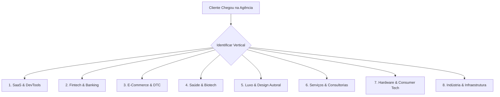

# MANUAL DE SEGMENTAÇÃO SETORIAL & GUIA ESTRUTURADO DE MOCKUPS (TEXTO + IMAGEM)
## Baseado na Extração Big Data (504 Empresas Globais & Agências de Elite)

Este manual é o guia operacional definitivo para arquitetar, prototipar e redigir sites de alta conversão para **qualquer segmento de cliente**, discriminando rigorosamente:
1. **O que é Padrão (Obrigatório / Higiênico)** vs **O que é Customizado (Diferencial de Elite)**.
2. **Como estruturar o Mockup Visual (Direção de Arte de Imagem e Layout)**.
3. **Como estruturar o Mockup Textual (Engenharia de Copywriting e PLN por Dobra)**.

---

# PARTE 1: SEGMENTAÇÃO SETORIAL (PADRÃO VS CUSTOMIZADO)



---

## 1. Vertical: B2B SaaS & DevTools
*Exemplos no dataset: Linear, Stripe, Supabase, Vercel, Framer, Raycast, PostHog.*

### 📋 Requisitos Padrão (Obrigatórios para Confiabilidade)
* **Navegação:** Menu superior fixo com *Features*, *Pricing*, *Docs/API*, *Changelog*, *Login* e botão CTA em destaque.
* **Tabela de Preços (/pricing):** Switcher Mensal/Anual (com badge de desconto ex: *"Save 20%"*), 3 a 4 planos (Free/Hobby, Pro, Team, Enterprise), lista de checkboxes com recursos e botão de ação por coluna.
* **Barra de Confiança (Trust Bar):** Logos monocromáticos em tons de cinza de 5 a 8 empresas clientes reconhecidas.
* **Segurança e Conformidade:** Selos de SOC2 Type II, GDPR/LGPD, ISO 27001 e criptografia de ponta a ponta no rodapé.

### 💎 Diferenciais Customizados (Padrão Elite das Grandes Agências)
* **Demo Interativa na Primeira Dobra:** Em vez de imagem estática, um player interativo ou miniatura funcional da interface que reage ao mouse/teclado.
* **Terminal / Code Snippet Interativo:** Abas com sintaxe de código em Node.js, Python, cURL, Go com botão *"Copy"* de um clique.
* **Bento Box Grid Modular:** Grade assimétrica com micro-animações, cursores simulados e visualização em tempo real de métricas.
* **Dark Mode Luminescente:** Fundo preto absoluto (`#000000` ou `#08090A`) com bordas sutis (`1px solid rgba(255,255,255,0.08)`) e gradientes radiais coloridos de baixa opacidade em hover.

---

## 2. Vertical: Fintech, Banking & Web3
*Exemplos no dataset: Revolut, Brex, Wise, Robinhood, Mercury, Coinbase, Plaid.*

### 📋 Requisitos Padrão (Obrigatórios)
* **Compliance e Regulatório:** Rodapé com número de licença bancária/CVM/Bacen, aviso de risco de investimento e proteção securitária (ex: FDIC / FGC).
* **Calculadora de Economia / Simulador:** Widget interativo para calcular taxas de câmbio, rendimento de CDI ou economia em cartão corporativo.
* **App Store Badges:** Links diretos para download na Apple App Store e Google Play com nota média e volume de avaliações.

### 💎 Diferenciais Customizados (Padrão Elite)
* **Mockup de Cartão Físico com Efeito Giro 3D / Holofote:** Render do cartão metálico/translúcido que reage ao movimento do cursor.
* **Gráficos Financeiros Animados e Fluidos:** Curvas de rendimento em SVG que se desenham ao rolar a página (*scroll-triggered drawing*).
* **Tipografia Tabular Monospaçada para Números:** Uso de fontes com numerais tabulares alinhados (ex: `Sohne Mono` ou `Roboto Mono`) para demonstrar precisão contábil.

---

## 3. Vertical: E-Commerce & DTC (Varejo de Consumo)
*Exemplos no dataset: Nike, Glossier, Gymshark, Allbirds, Rimowa, Away, Kith, Salomon.*

### 📋 Requisitos Padrão (Obrigatórios)
* **Navegação com Busca e Carrinho Lateral (Drawer):** Ícone de busca preditiva, seletor de moeda/idioma e carrinho lateral deslizante sem redirecionamento de página.
* **Grade de Produtos com Filtros Instantâneos:** Filtros por tamanho, cor, preço e categoria com transição instantânea sem recarregar tela.
* **Social Proof e Avaliações de Usuários (UGC):** Média de estrelas visível no card do produto e galeria de fotos de clientes reais marcados no Instagram/TikTok.
* **Garantias Transparentes:** Ícones de *"Frete Grátis acima de R$ X"*, *"Devolução em até 30 dias"* e *"Pagamento em 10x sem juros"*.

### 💎 Diferenciais Customizados (Padrão Elite)
* **Quick-Add com Seletor de Variantes no Hover:** Passar o mouse sobre o produto exibe miniaturas das cores e tamanhos disponíveis para compra imediata.
* **Hero Editorial / Lookbook Imersivo:** Vídeo em tela cheia com corte dinâmico e tipografia display experimental (*Syne*, *Clash Display*).
* **Guia de Tamanhos com Algoritmo Recomendador:** Quiz rápido de 3 perguntas para indicar o caimento ideal.

---

## 4. Vertical: Saúde, Clínicas & HealthTech
*Exemplos no dataset: Hims, Ro, One Medical, Maven Clinic, Levels Health, Eight Sleep.*

### 📋 Requisitos Padrão (Obrigatórios)
* **Credenciais e Responsabilidade Técnica:** CRM dos médicos responsáveis, certificações sanitárias (ANVISA / FDA) e comitê científico visível.
* **Fluxo de Agendamento ou Triagem:** Botão de agendamento online com calendário ou formulário de triagem passo a passo.
* **FAQ Médico Detalhado:** Seção de perguntas frequentes sanando dúvidas sobre tratamentos, prescrições e convênios atendidos.

### 💎 Diferenciais Customizados (Padrão Elite)
* **Quiz de Diagnóstico Personalizado com Gamificação:** Questionário interativo em formato de cartões que gera um plano customizado ao final.
* **Paleta Tonal Serena & Orgânica:** Fundo off-white ou areia (`#FBF9F5` / `#F4F6F4`), tipografia acolhedora (*Plus Jakarta Sans*) e acentos em verde sálvia ou terracota.
* **Comparativo Antes/Depois com Slider Interativo:** Controle deslizante para visualizar a evolução clínica ou de exames.

---

## 5. Vertical: Luxo, Moda & Arquitetura High-End
*Exemplos no dataset: Balenciaga, Bottega Veneta, Leica, Porsche, Hermes, Vitra, Boffi.*

### 📋 Requisitos Padrão (Obrigatórios)
* **Foco Extremo na Fotografia / Render:** Ausência total de ilustrações genéricas; 100% de imagens autorais de altíssima definição.
* **Formulário de Atendimento Private / Concierge:** Campo discreto para agendamento de visita exclusiva, catálogo sob encomenda ou contato via WhatsApp Executivo.

### 💎 Diferenciais Customizados (Padrão Elite)
* **Minimalismo Radical com Generoso Espaço Negativo:** Margens ultra-largas (ex: 80px - 140px), poucos blocos de texto e foco no ritmo visual.
* **Tipografia Serifada Editorial de Grande Impacto:** Títulos em *Editorial New*, *Ogg* ou *Cinzel* com subtítulos leves em caixa alta e espaçamento expandido (*letter-spacing: 0.15em*).
* **Navegação Invisível / Menu Hambúrguer Minimalista:** Header limpo contendo apenas o logotipo e o ícone de menu que abre em overlay cinematográfico.

---

## 6. Vertical: Agências Criativas, Estúdios & Consultorias
*Exemplos no dataset: Work & Co, Metalab, Instrument, Huge, Locomotive, Cuberto, Active Theory, Bolha, Pentagram.*

### 📋 Requisitos Padrão (Obrigatórios)
* **Galeria de Projetos Selecionados (/work):** Cards de grande escala mostrando os clientes atendidos, categoria e escopo.
* **Página de Contato Direta com Briefing Rápido:** Formulário com seleção de faixa orçamentária (budget), prazo e tipo de serviço.

### 💎 Diferenciais Customizados (Padrão Elite)
* **Showreel / Vídeo Manifesto no Hero:** Vídeo de alta energia em loop sem som no background ou em modal expansível.
* **Cursor Customizado e Transições de Página em WebGL:** Cursor magnético que se expande ao passar sobre cards de projetos (*"View Project"*).
* **Estudos de Caso Estruturados em Storytelling:** Cada projeto possui uma página detalhando: *O Desafio -> O Insight -> A Execução Visual -> As Métricas de ROI*.

---

# PARTE 2: GUIA PRÁTICO PARA CONSTRUÇÃO DE MOCKUPS (TEXTO + IMAGEM)

Ao criar uma nova proposta, wireframe ou mockup no Figma/código para um cliente, estruture o site nas **5 Dobras Fundamentais**:

```markdown
┌──────────────────────────────────────────────────────────────────────────┐
│ DOBRA 1: HERO SECTION (Posicionamento Imediato em < 3 Segundos)          │
├──────────────────────────────────────────────────────────────────────────┤
│ DOBRA 2: TRUST & SOCIAL PROOF (Validação Social e Números)               │
├──────────────────────────────────────────────────────────────────────────┤
│ DOBRA 3: CORE VALUE & PRODUCT SHOWCASE (Bento Grid ou Demonstração)      │
├──────────────────────────────────────────────────────────────────────────┤
│ DOBRA 4: SOCIAL PROOF PROFUNDA / CASE STUDY / DEPOIMENTO                 │
├──────────────────────────────────────────────────────────────────────────┤
│ DOBRA 5: FINAL CONVERSION & FOOTER COMPLETO (CTA de Fechamento)          │
└──────────────────────────────────────────────────────────────────────────┘
```

---

## Estrutura Detalhada por Dobra:

### Dobra 1: Hero Section
* **Mockup de Imagem / Mídia:**
  - **SaaS / DevTools:** Mockup do software em perspectiva isométrica leve ou moldura flutuante (*frameless wrapper*) com sombra difusa colorida (`box-shadow: 0 20px 80px rgba(0,0,0,0.5)`).
  - **E-Commerce / DTC:** Foto editorial do produto em uso real com iluminação natural.
  - **Serviços / Agências:** Showreel dinâmico em loop com tipografia gigante sobreposta.
* **Mockup Textual (PLN Blueprint):**
  - `Badge / Eyebrow:` `[ NOVIDADE / VERSÃO 2.0 / LÍDER DE MERCADO ]` (12px, Caps, semi-bold).
  - `Headline H1:` `[ Verbo de Impacto ] + [ O que você faz ] + [ Para quem ] + [ O Maior Benefício ]`
    - *Exemplo SaaS:* "Acelere seu desenvolvimento de software com automação em tempo real."
    - *Exemplo E-commerce:* "O tênis mais confortável que você já calçou. 100% sustentável."
    - *Exemplo Agência:* "Criamos produtos digitais que definem a liderança de mercado."
  - `Subheadline P:` 2 a 3 linhas (máximo 30 palavras) detalhando a mecânica da solução.
  - `Duplo CTA:` `[ Botão Primário de Conversão ]` (cor vibrante) + `[ Botão Secundário / Ver Demonstração ]` (outline/ghost).

### Dobra 2: Barra de Confiança (Social Proof)
* **Mockup de Imagem:** 5 a 8 logos de clientes reconhecidos em escala de cinza e opacidade de 60%, alinhados horizontalmente com espaçamento uniforme.
* **Mockup Textual:** *"Utilizado por mais de 50.000 empresas inovadoras em todo o mundo"*.

### Dobra 3: Bento Box Grid de Funcionalidades
* **Mockup de Imagem:** Grade com 3 a 4 cartões modulares:
  - *Card 1 (Grande, 2 colunas):* Animação do fluxo principal ou gráfico de performance.
  - *Card 2 (1 coluna):* Terminal interativo ou widget de integração.
  - *Card 3 (1 coluna):* Card de segurança com ícone de cadeado e dados criptografados.
* **Mockup Textual:**
  - `H2 da Seção:` "Tudo o que você precisa para escalar sem atrito."
  - `H3 por Cartão:` "Automação Instantânea", "Segurança Enterprise", "Analytics em Tempo Real".
  - `Texto de Apoio:` 1 frase explicativa concisa por card.

### Dobra 4: Depoimento de Alto Impacto / Estudo de Caso
* **Mockup de Imagem:** Foto em alta resolução do cliente / decisor em fundo neutro + logotipo da empresa cliente.
* **Mockup Textual:**
  - `Citação Principal (H3):` *"Aumentamos nossa taxa de conversão em 42% nas primeiras duas semanas após a migração."*
  - `Autor & Cargo:` **Carlos Mendes**, VP de Produto na *Empresa Global*.
  - `Métrica Numérica Destacada:` **+42% de Conversão** | **3x Mais Rápido**.

### Dobra 5: CTA de Fechamento & Rodapé Institucional
* **Mockup de Imagem:** Fundo escuro com gradiente radial suave centralizado ou padrão geométrico de baixo contraste.
* **Mockup Textual:**
  - `Headline H2:` "Pronto para transformar a experiência digital da sua empresa?"
  - `Subheadline:` "Comece gratuitamente hoje mesmo. Sem necessidade de cartão de crédito."
  - `Botão CTA Principal:` `[ Criar Conta Gratuita / Falar com Especialista ]`
  - `Links do Rodapé:` 4 a 5 colunas (*Produto, Soluções, Recursos, Empresa, Legal*).

---

# PARTE 3: MATRIZ DE RECOMENDAÇÃO RÁPIDA (CHEATSHEET DE PRODUÇÃO)

| Vertical do Cliente | Paleta de Cores Recomendada | Pareamento de Fontes | Estilo de Mídia Ideal | CTA Principal Recomendado |
| :--- | :--- | :--- | :--- | :--- |
| **SaaS B2B & Tech** | Fundo Preto (`#0B0C0E`), Borda Cinza, Acento Roxo/Azul Elétrico | `Inter` (Bold) + `JetBrains Mono` | Mockup de Interface Vetorial | `Começar Gratuitamente` |
| **Fintech & Bancos** | Azul Marinho Nobre (`#0B1B3D`), Fundo Branco, Acento Verde | `Sohne` / `Neue Haas` + `Roboto Mono` | Cartão 3D e Gráfico Interativo | `Abrir Minha Conta` |
| **E-Commerce & DTC** | Fundo Off-White (`#F9F9FB`), Preto Puro, Acento Coral/Laranja | `Syne` / `Clash Display` + `Satoshi` | Foto Editorial Autêntica de Produto | `Comprar Agora` |
| **Saúde & Clínicas** | Fundo Creme (`#FBF9F5`), Verde Sálvia (`#2D5A43`), Azul Sereno | `Plus Jakarta Sans` + `Open Sans` | Fotografia Humanizada Real + Quiz | `Agendar Consulta` |
| **Luxo & Alta Moda** | Fundo Preto/Branco Puro, Cinza Platina, Dourado Champagne | `Editorial New` (Italic) + `Helvetica Now` | Fotografia Full-Bleed Cinematográfica | `Solicitar Atendimento Exclusivo` |
| **Agências & Design** | Fundo Escuro Profundo, Neons Suaves, Tipografia Gigante | `Sora` / `PP Neue Montreal` + `Space Grotesk` | Showreel em Vídeo + Cards Interativos | `Iniciar um Projeto` |
